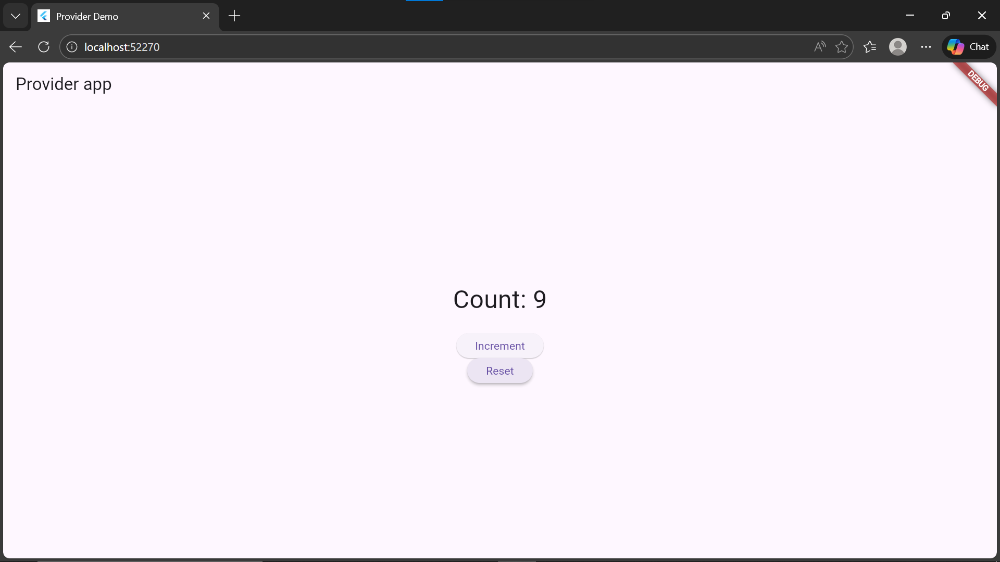

# Flutter State Management — Assignment #1
### Topic: Provider State Management
> CSE Year 3 | Flutter Development

---

## 📁 Project Structure

```
lib/
 ├── main.dart            # App entry point — ChangeNotifierProvider setup
 ├── counter_state.dart   # State class extending ChangeNotifier
 └── counter_page.dart    # UI — Consumer widget and button interactions
```

---

## 🚀 Getting Started

### Prerequisites
- Flutter SDK installed
- VS Code or Android Studio
- A connected device or emulator

### Installation

```bash
# Clone the repository
git clone https://github.com/Croixfx/State-Management-Flutter.git

# Navigate into the project
cd my_app

# Install dependencies
flutter pub get

# Run the app
flutter run
```

---

## 📦 Dependencies

```yaml
provider: ^6.1.1
```

---

## 🧠 How Provider Works in This App

| Step | File | What it does |
|------|------|--------------|
| 1 | `pubspec.yaml` | Adds the provider package |
| 2 | `counter_state.dart` | Defines state with `ChangeNotifier` |
| 3 | `main.dart` | Wraps app with `ChangeNotifierProvider` |
| 4 | `counter_page.dart` | Reads state using `Consumer<CounterState>` |
| 5 | `counter_page.dart` | Updates state via `Provider.of(..., listen: false)` |

---

## ✍️ Assignment Sections

- **Section 1** — Explanations of Provider, Riverpod, Bloc, and GetX *(Handwritten)*
- **Section 2** — Comparison table of when to use each solution *(Handwritten)*
- **Section 3** — Detailed Provider implementation with code snippets *(This project)*

---

## 👤 Croix

**Jean De La Croix**  
CSE Year 3


